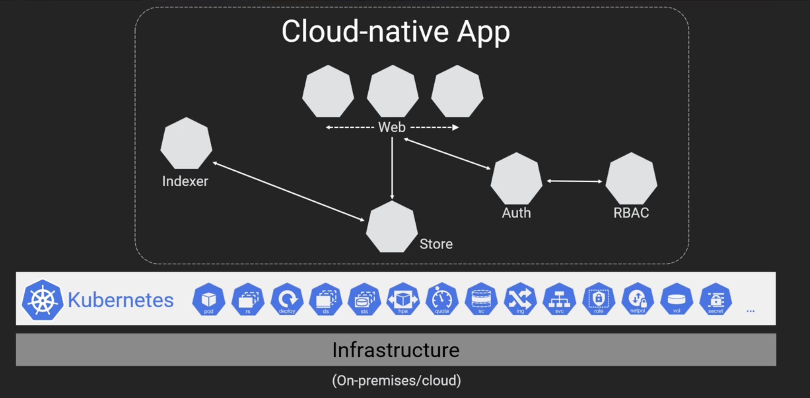
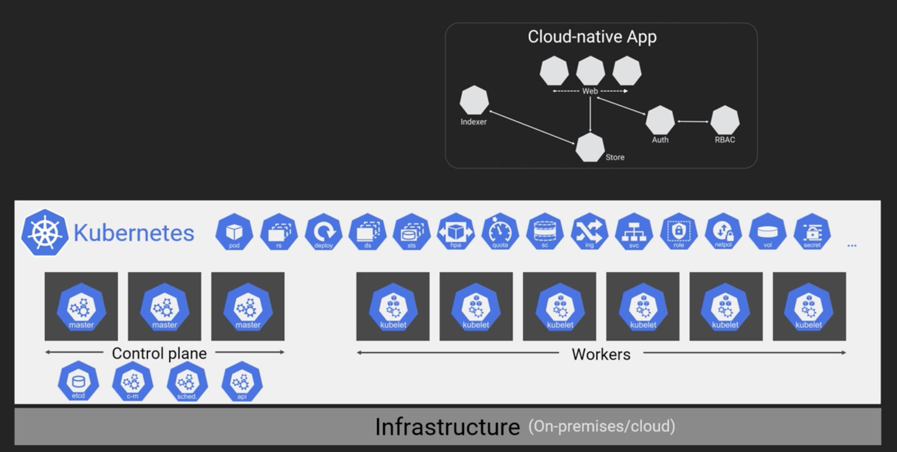
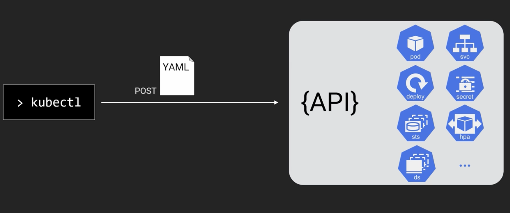
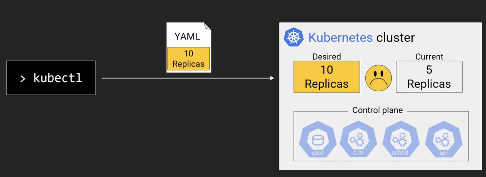
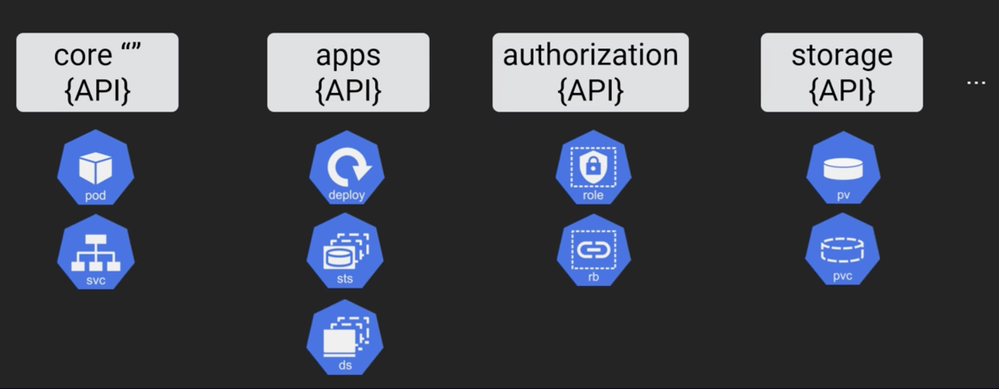

# Kubernetes 

## The Big picture 

- Kubernetes is an open source platform for running cloud native apps.
- Kubernetes provides an api and rich set of primitives for running cloud native apps.

- Kubernetes cluster is made up of group of linux systems. These are divided into two groups.
  - Control plane
    - This is where the whole cluster state is managed and this needs to be highly available.
    - Control plane consists of api server, scheduler, controllers and a persistent storage(like etcd)
    - `Api Server:` This implements the api and is the central part of the control plane.
      - All requests to create, update, delete api objects happen through api server.
      - Api objects consists of deployments, services, pods, volume, pv, hpa, secret, role etc. 
    - `Schedulers and Controllers:` These take care of the mechanics of making the requests to api server happen.
      - For ex, scheduler places the pod on a node.
    - `Persistent Store:` It is the only stateful component of the entire control plane.
      - In a production environment this persistent store should run as a separate cluster for HA. 
      This makes the control plane stateless and upgrades to the cluster becomes easy.
  - Worker nodes
    - Worker nodes consist of pods(apps) and agents(kubectl) to interact with api server.

  

## Kubernetes API

- It is a standard restful api that supports CRUD style operations.
- Mostly we use CLI utility called `kubectl` for interacting with api server to create api objects like deployments, services etc.
  - We define various parts of the api using yaml file and use `kubectl` to post them to Api server.

- Kubernetes control plane manages the current state of an app to be inline with desired state.
- If a new yaml is sent to api server with new desired state, then various parts of the control plane(runs a watch loop) 
  come into action to update the current state.

### API groups
- The core api which was originally a monolith is now divided into various groups like Core API, apps, authorization, storage etc.

- SIGs(special interest groups) manage api groups. The list of people who manages sigs can be seen here: [API SIGs](https://github.com/kubernetes/community/blob/master/sig-list.md)
  - Each api group is versioned 
    - alpha(experimental. ex: v1alpha1), 
    - beta(most of them are stable ex: v2beta1)
    - GA(stable and available for public ex: v1)

## Kubernetes objects

- Kubernetes doesn't run containers directly, it runs them through a high level construct called pod.
  - In Virtualization world the atomic unit of scheduling is VM
  - In docker, it is the container.
  - In kubernetes, it is pod.

- `Pod:` A pod is an object in the cluster and it is defined under v1 API group.
  - Pods directly won't help much, so they are wrapped in a high level object called a deployment.
- `Deployment:` It is an object on the cluster and it is defined under apps/v1 API group.
  - Deployment makes managing pods easier and flexible. For ex, scaling, rolling updates etc.
- `Daemonsets:` This also wraps a pod like a deployment object, but this ensures at most one pod per worker node in the cluster.
- `Stateful sets:` These are pods for specific parts of the application for stateful requirements. For ex, creating databases.
- There are other API objects like secret, pv(persistent volume), pvc(persistent volume claim), svc(service) etc.
  - These are all resources that get deployed on to the cluster.
  