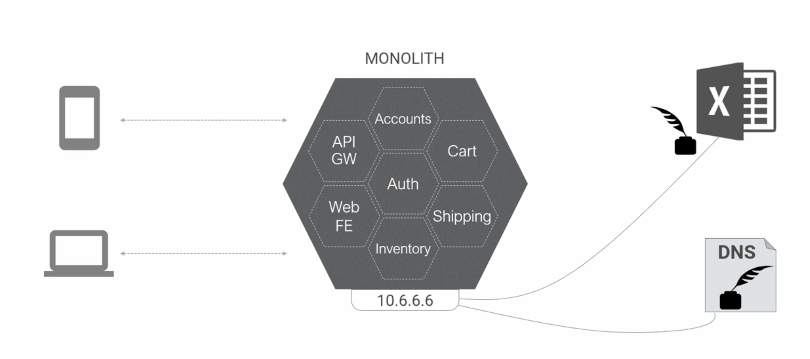
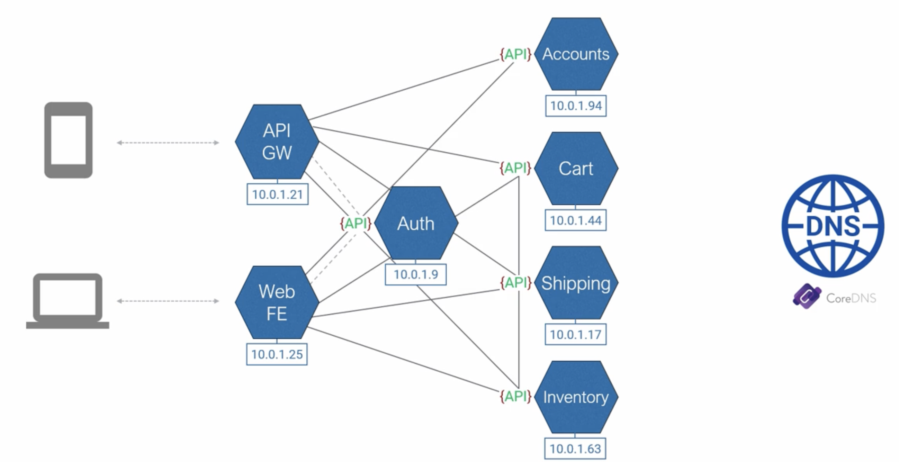
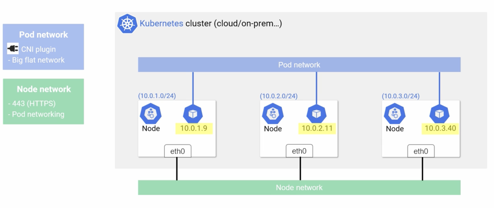

# Kubernetes Networking

- Networking has become far more important than ever in the microservices world.
- Each microservice is a network end point with it's own ip address and port.
- With microservices adding and removing of nodes are very common with scaling operations, rolling updates etc.
- In the cloud native world, applications are demanding the networks to be dynamic and scalable and handle massive ip churn
  and provide good service discovery.

  

  

## Kubernetes networking basics

- Rules
    - All nodes on the cluster can communicate with each other.
    - All pods on the cluster can communicate with each other without NAT.
    - Every pod gets its own IP.
- Types of networks
    - Node network
        - Kubernetes doesn't implement node network.
    - Pod network
        - Kubernetes implements pod network.
        - It provides a network plugin interface called CNI(container network interface). Third parties provides the plugins
          that implement the pod network.
        - This pod network is stretched across all nodes and every pod has an ip on it.
        - Each node is allocated a subset of addresses from pod network.
        - When a pod is scheduled to a node, it gets the ip addresses allocated for that node.
        - This ip address is accessible from all other pods across all pods in the pod network.

      

## Demo

- To list all nodes in the k8s cluster `kubectl get nodes`.
- The below yaml file runs 3 replicas(or pods) of the ubuntu server on the cluster.
- This configuration is to demo pods interaction over pod network.
- save the file as `ping-deploy.yaml`.
```yaml
apiVersion: apps/v1 
kind: Deployment
metadata:
  name: pingtest
  labels:
    app: pinger
spec:
  replicas: 3
  selector:
    matchLabels:
      app: pinger
  strategy:
    type: Recreate
  template:
    metadata:
      labels:
        app: pinger
    spec:
      containers:
      - image: ubuntu:latest
        name: ubuntu-ctr
        command:
          - /bin/bash
          - "-c"
          - "sleep 60m"
        imagePullPolicy: IfNotPresent
      restartPolicy: Always
```

- To deploy the yaml file on to the cluster use the command `kubectl apply -f .\ping-deploy.yaml`
- The command to view deployment is `kubectl get deploy`.
- The command to for wide view of pods `kubectl get pods -o wide`.
- To list the CIDR blocks allocated for pods by the nodes use the command `kubectl get nodes -o jsonpath='{.items[*].spec.podCIDR}'`.
- To execute a command on a pod `kubectl exec -it ${podname} ${commandname}`. Ex: `kubectl exec -it pingtest-6769c69dd5-h2x76 bash`.
