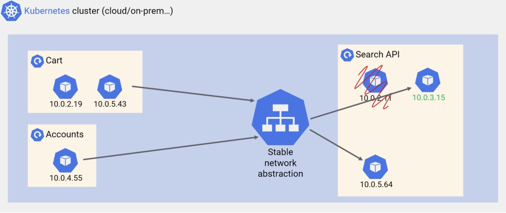
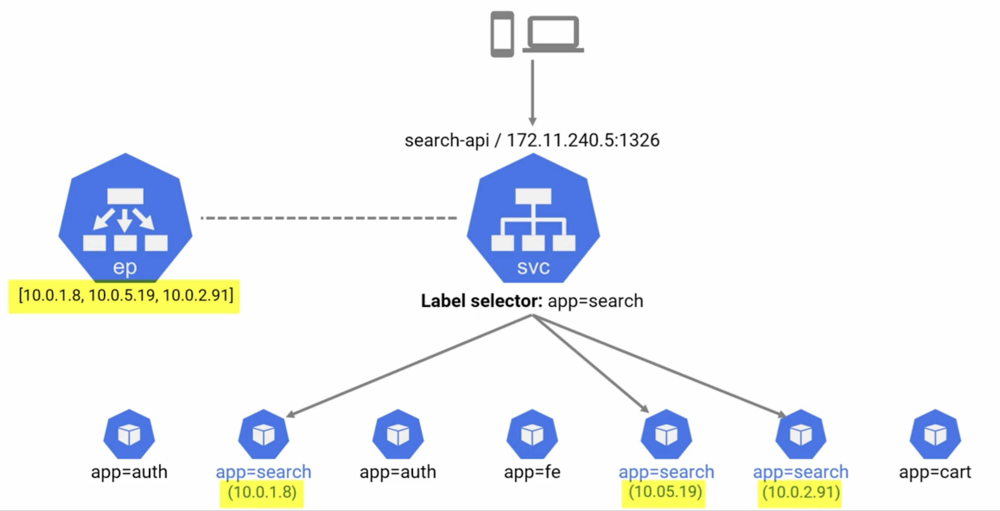
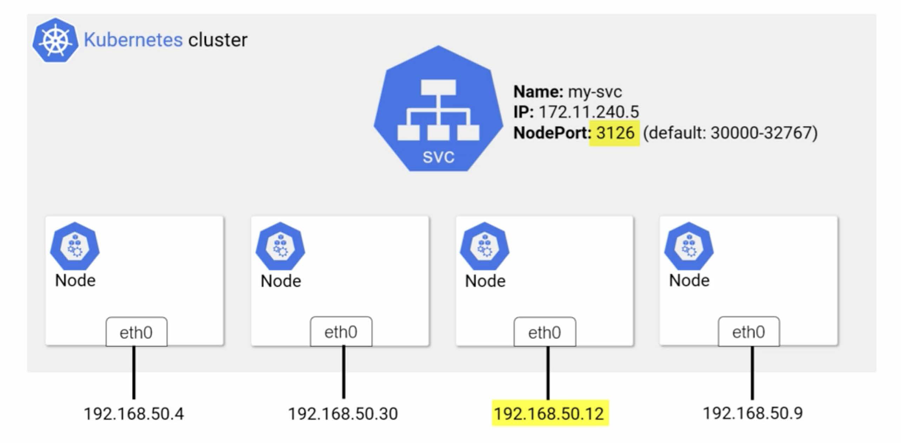
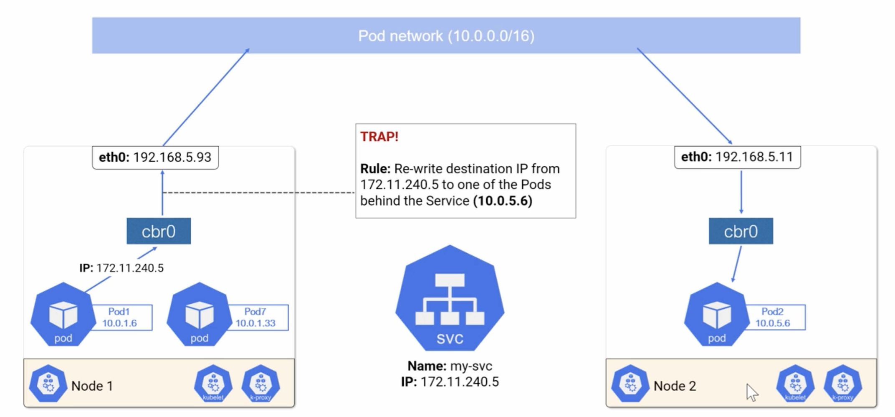

## Kubernetes Services

- Pods are created/Deleted when scaled up or down a microservice with Scaling and or Updates.
- Services manage the network abstraction for those pods to direct traffic to the ones which are ready/healthy to serve.
- So Services are placed before pods. Instead of hitting pods directly hit the services.
- Think of services as load balancers or proxies.

  

### How does service work?

- Frontend
    - Every service gets a name and an ip address. The ip address of the service never changes in its entire life span.
    - The name and ip address are registered with cluster's native DNS server.
    - Every pod on the cluster knows how to use cluster's native DNS server and reach a service.
- Backend
    - A service should know which pods to send the traffic to. This works through label selectors(app:search).
    - Service balance traffic across all pods with the given label.
    - Endpoints
        - A service knows about all pods that belongs to a specific app.
        - To know the details about all active/healthy pods that belong to a service it relies on endpoints.
        - An endpoint object is a list of pod ip addresses/ports that matches the given service's label selector.
        - A service object always watches the api server to see if new pods are added/removed.
        - If there is a change, the service automatically update the endpoints.
        - An endpoint object has the same name as that of the service it is associated with.

  

## Service Types

- There are three types of services
    - ClusterIP
        - This is the default.
        - Gets own IP.
        - Only accessible with in the cluster.
    - NodePort
        - This is accessible from outside the cluster.
        - This gets a cluster wide port instead of own IP for service. It means each Service gets a unique port.
        - Take any node's IP in the cluster and append the NodePort to that, the service associated to the port can be reached from with in the cluster and from outside as well.
        - The default port range for NodePort service type is from 30000 to 32767.
            - This port can be changed with the flag --service-node-port though rarely required
        - The advantage of using this service type is to share the same cloud provider load balancer to multiple services with in the cluster.
    - LoadBalancer
        - This provides cloud platforms load balancer and integrates with the service in the cluster.
        - Kubernetes internally creates a nodeport service and assigns that to that external load balancer.
        - The disadvantage with this approach is that each service gets its own external load balancer which may not be required.

      

```yaml
apiVersion: v1
kind: Service
metadata:
  name: wordpress
  labels:
    app: wordpress
spec:
  type: NodePort
  ports:
    - port: 80
      nodeport: 30080
  selector:
    app: wordpress
```  

## The Service Network

- Service in kubernetes gets a unique, long-lived ip address, but it doesn't belong to either node network or pod network.
- It is on a different network called Service Network.
- This is not an actual network and no rules defined either even if debugged through networking tools.
- Kube-proxy
    - Every node on the cluster runs a process called `kube-proxy` which runs as a daemon set. so, it runs one pod per node.
    - Its job is to write ipvs/iptable rules to each node.
    - They basically define mappings for each service.
    - This ensures any request with headers to service network will be rewritten with appropriate pods on the pod network.
- Request flow
    - The pod wants to send the request to service network.
    - It gets the service ip from dns server.
    - The pod sends request packets to its virtual ethernet interface.
    - The interface(eth0) sends packets to default gateway.
        - This gateway is the linux cbr bridge called cbr0.
        - This is equivalent to docker0, but kubernetes named it cbr0(custom bridge 0).
    - To get to eth0, packets get routed through the kernel of the host system.
    - The kernal gives the list of mappings for this ip address from ipvs/iptables and route the packets to one of the pods.

  

### IP tables/ IPVS tables

- Ip tables
    - Since kubernetes 1.2, running iptables in kube-proxy is the default mode.
    - This doesn't scale well beyond certain limit.
    - Ip tables is a packet filtering technology for Firewalling.
    - In kubernetes we are using this as a load balancer which is really not designed for load balancing

- IPVS mode
    - It is stable since kubernetes 1.11.
    - It uses linux kernel ip virtual server, which is designed more as a load balancer.
    - It scales better than ip tables at this.
    - It supports many other load balancing technologies like least connection, source hashing, shortest expected delay though
      round-robin is the default.

## Demo

- The yaml configuration file for sample-web.yaml.

```yaml
apiVersion: v1
kind: Service
metadata:
  name: hello-svc
  labels:
    app: hello-world
spec:
  type: NodePort
  ports:
  - port: 8080
    nodePort: 30001
    protocol: TCP
  selector:
    app: hello-world
---
apiVersion: apps/v1
kind: Deployment
metadata:
  name: hello-deploy
spec:
  replicas: 10
  selector:
    matchLabels:
      app: hello-world
  minReadySeconds: 10
  strategy:
    type: RollingUpdate
    rollingUpdate:
      maxUnavailable: 1
      maxSurge: 1
  template:
    metadata:
      labels:
        app: hello-world
    spec:
      containers:
      - name: hello-pod
        image: nigelpoulton/acg-web:0.1
        ports:
        - containerPort: 8080
```
- The above configuration is for a simple web server which got a service `hello-svc` assigned to it.
- As we know services get reliable ipaddresses and ports, this `hello-svc` gets assigned a random clusterIp.
- This ip is registered with DNS. This is a `NodePort` service with port `30001`.
- All requests that are forwarded to nodeport service at 30001 are forwarded to pods at `8080`.
- To deploy the app `kubectl apply -f sample-web.yaml`.
- To view the service `kubectl get svc hello-svc`.
- NodePort services also get ClusterIP assigned to it.
- The web services can be accessed by either `${clusterIP}:${containerPort}` or `${anyNodeIP}:{NodePort}`.
  Ex: `10.15.244.182:8080` or `<node-ip>:30001`
- To access the application from any pod within the cluster `curl hello-svc:8080`  
- To access with nodeip address `curl 10.166.0.2:30001`.
- It is very common to access the pod(or app) using service name and containerPort.

## Demo LoadBalancer Service

- The above NodePort service is accessible within the cluster.
- If we are using managed cloud service like GKE, we can use LoadBalancer service to access the app from external network.

```yaml
apiVersion: v1
kind: Service
metadata:
  name: lb-svc
  labels:
    app: hello-world
spec:
  type: LoadBalancer
  ports:
  - port: 8080
  selector:
    app: hello-world
```

- The above configuration creates a LoadBalancer Service and assigned it to the pods running with the label `hello-world` at port `8080`
- As we know the pods already exists, but still it creates a new service before them.
- Lets name the yaml `lb.yaml` and run the command `kubetcl apply -f .\lb.yaml`.
- This takes some time to get assign a load balancer. To watch this `kubectl get svc --watch`.
