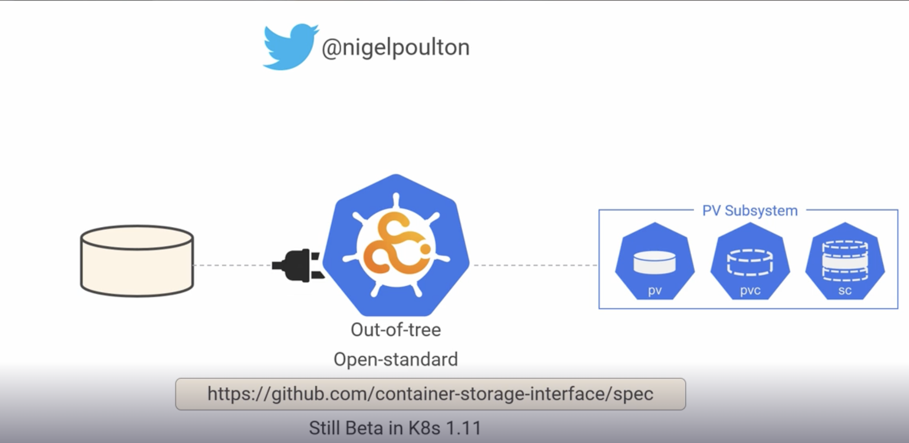
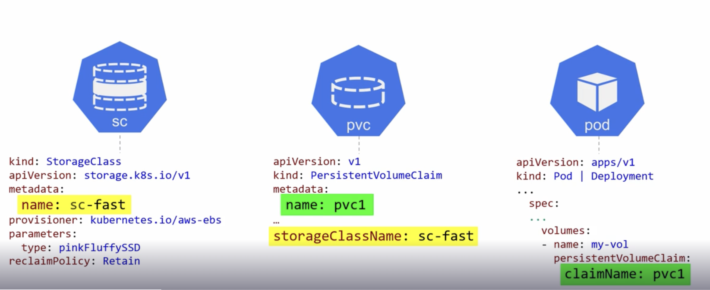

## Volumes

- The basic primitive of volumes is to abstract storage from k8s pods.
- Without volumes data will be lost if a pod is removed from cluster.
- Volumes exist on the cluster on their own, mostly provided by the cloud provider.
- If a pod wants to use volume, it needs to create a claim(pvc) and mount it.
- Volumes can be shared between multiple pods.
- Volumes have different acronyms like LUNs, devices, shares, mounts, spaces etc based on the underlying platform.
- Fundamental storage requirements include speed, replication, resiliency etc.
- Kubernetes provides all the fundamental storage requirement but leaves most of them to the cloud storage provider like ebs, s3 etc. 
- Kubernetes provides the interface for the pods to consume these cloud services.
  - This interface is called Cloud storage Interface(CSI).
  - This interface is implemented by cloud storage providers.
  - On the k8s side, CSI leverages kubernetes api objects for easy consumption.
- K8S storage majorly consists of 3 objects.
  - Persistent Volume(PV)
    - It's a storage resource like a 20 GB SSD.
  - Persistent Volume Claim(PVC)
    - It is like an applications unique identifier to use PV.
  - Storage Class(SC)
    - To implement PV and PVCs dynamically.

## Container Storage Interface(CSI)

- Before CSI was introduced the driver code to interact with all external service providers was present in k8s.
- This has lot of disadvantages 
  - The updates to these drivers depend on k8s release cycles.
  - Making driver code open source is not agreed by many vendors.
- CSI is open source and not tied to specific provider like k8s.
- This works with docker swarm as well as long as orchestrator and vendors support and implement CSI.
- K8S is an implementation of CSI. This is new and still in beta with k8s 1.11, but expected to have good future.


## Persistent Volume(PV)

- PV has attributes like size, iops etc.
- They can also be attributed to various tiers in the backend storage provider.
- In GKE persistent disk(block device) comes in two flavours.
  - Standard
  - SSD
- We can configure them using GCEPersistentDisk which is made available to k8s via CSI.
- Sample yaml configuration for PV.

```yaml
apiVersion: v1
kind: PersistentVolume
metadata:
  name: pv1
spec:
  accessModes:
  - ReadWriteOnce
  storageClassName: ssd
  capacity:
    storage: 20Gi
  persistentVolumeReclaimPolicy: Retain
  gcePersistentDisk:
    pdName: uber-disk  
```
- The above PV uses a gcePersistentDisk with name `uber-disk`. This disk should have been created on GCP prior to creating PV.
- To create PV with yaml use the command `kubectl apply -f .\gke-pv.yaml`.
- To list PVs `kubectl get pv`

## AccessModes
- There are three ways a pod can access its volume.
  - RWO(ReadWriteOnce)
    - can be read/write by one pod in the cluster
  - RWM(ReadWriteMany)
    - Multiple pods can read/write
  - ROM(ReadOnlyMany)
    - Multiple pods with read-only access.
- Not all volumes support all modes
- A single volume can be opened in one mode at a time.
  - Two different pods cannot read the PV in two different modes.
  - This means We cannot have two active claims against a volume with different policy .

## Reclaim policy

- There are two different policies which define what should happen a claim on the volume is released.
  - Delete
    - Releasing a claim on a volume, k8s will delete the volume in the storage backend if the backend supports.
  - Retain
    - This keeps the volume and its contents event after release the claim.

## Persistent Volume Claim(PVC)  
- To use a PV a pod needs PVC.
- Both PV and PVC are resources on the k8s api and an object on the cluster.
- Sample yaml configuration for PVC.

```yaml
apiVersion: v1
kind: PersistentVolumeClaim
metadata:
  name: pvc1
spec:
  accessModes:
  - ReadWriteOnce
  storageClassName: ssd
  resources:
    requests:
      storage: 20Gi
```

- Both PV and the associated PVC should have matching values in the spec as defined above.
- For the PVC on the PV accessModes, storageClass and capacity should match in both the files.
  - If the claim asks for less capacity than PV, PVC works. 
  - If claim asks more storage than defined in PV then binding won't work and PVC stays in pending state.
- The default claim policy is `Retain`. 
  - If a claim is released and want to use that storage volume with another claim, the PV has to be deleted and recreated.

## Mounting a Volume

- To mount a volume on to a Pod two attributes persistentVolumeClaim and volumeMounts should be defined.
- The sample yaml configuration can be seen below.

```yaml
apiVersion: v1
kind: Pod
metadata:
  name: volpod
spec:
  volumes:
    - name: data
    persistentVolumeClaim:
      claimName: pvc1
containers:
  - name: ubuntu-ctr
    image: ubuntu:latest
    command:
    - /bin/bash
    - "-c"
    - "sleep 60m"
    imagePullPolicy: IfNotPresent
    volumeMounts:
    - mountpath: /data
      name: data
```

## Storage Class

- The creation of PV and matching that to the backend storage is manual and doesn't scale well.
- Storage classes provide dynamic provisioning of storage.
- Storage class is also an api resource and an object on the k8s cluster.
- Here is the sample yaml file.

```yaml
kind: StorageClass
apiVersion: storage.k8s.io/v1
metadata:
  name: fast
provisioner: kubernetes.io/aws-ebs
parameters:
  type: io1
  zones: eu-west-1a
  iopsPerGB: "10"
---
kind: StorageClass
apiVersion: storage.k8s.io/v1
metadata:
  name: slow
  annotations: 
    storageclass.kubernetes.io/is-default-class: "true"
provisioner: kubernetes.io/aws-ebs
parameters:
  type: gp2
  zones: eu-west-1a
reclaimPolicy: Retain
mountOptions:
  - debug
```

- Few attributes like parameters are attributes of the backend storage not k8s.
  - K8S admin cares about parameters because the values depend on storage provider.
- `apiVersion` for StorageClass is under `storage.k8s.io/v1`.
- `provisioner` defines storage provider type.
- `type` defines the type of storage cloud provider name. 
  - AWS has given name `io1` for fast SSD.
  - The name `gp2` is for slow general purpose SSD.
- `zones` define the zone of the storage of cloud provider.
- `iopsPerGB` defines the no of io operations per GB.



- To view the list of storage class objects on k8s, `kubectl get sc`.
- To view specific storage class `kubectl get sc fast`.
- To view complete details of a sc `kubectl describe sc fast`.

- PVC yaml configuration has a parameter `storageClassName` whose value should match that of storage class name.  
```yaml
apiVersion: v1
kind: PersistentVolumeClaim
metadata:
  name: aws-fast
spec:
  accessModes:
  - ReadWriteOnce
  storageClassName: fast
  resources:
    requests:
      storage: 10Gi
```
- If the above yaml file is deployed to k8s, it creates a pv without manually creating.

- We have created storageClass and plugged that into elastic search backend.   
- A request from PVC to claim for a storage on the backend creates storage in the backend and also creates a PV on the k8s cluster.

#### Sometimes if a pvc declaration is found without sc, it means pvc is using the underlying cloud's default storage class.

