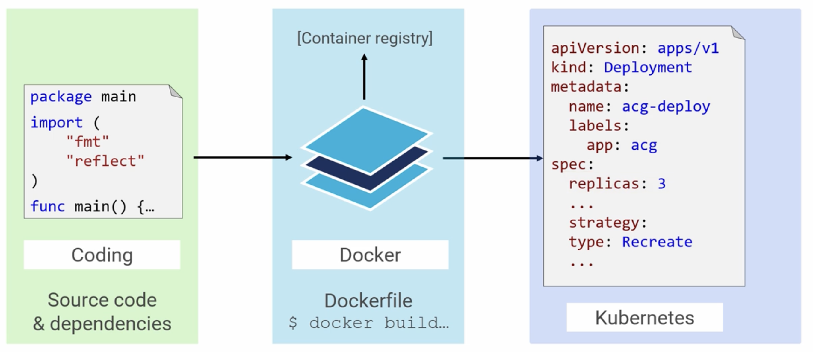

## Big picture

- Source code and dependencies of a project is usually placed in a directory(git repo directory).
- A Dockerfile is placed on to the root of the source code.
  - The Dockerfile contains list of instructions to build the source code and creates a docker image from it.
  - The docker image is pushed into a docker registry like docker hub.
  - Most of the cloud providers have their own registries for maintaining and versioning of the images.
- Deployment to k8s usually happens through k8s objects like deploy, sts or ds etc, though deploy is the most common.

## Demo

- The complete source code, docker file and k8s deployment configuration can be found here. 

[Code to Deployment](https://github.com/tulasidamarla/acg-k8s-dd)

- To build an image from the source code use the command from the directory where dockerfile is present.
  - `docker build -t tulasidamarla/acg-web:0.1 .` where `-t` represents tag.
  - Tags are versions of the project and usually created in the format `dockerid/project_name:version`
- To save the image created in the above step run the below commands.
  - `docker login`
  - `docker push tulasidamarla/acg-web:0.1`
- To deploy the image created in the above step, it has to be mentioned in the deployment.yaml configuration.
  - Usually pods are not deployed directly. It is either deploy, ds or sts that are commonly deployed.
  - For sample refer to the file [deployment yaml](https://github.com/tulasidamarla/acg-k8s-dd/blob/master/code-k8s/web-deploy.yml)
  - Refer to deploy or nodeport yaml configurations to place a service before pods based on the k8s environment.
  