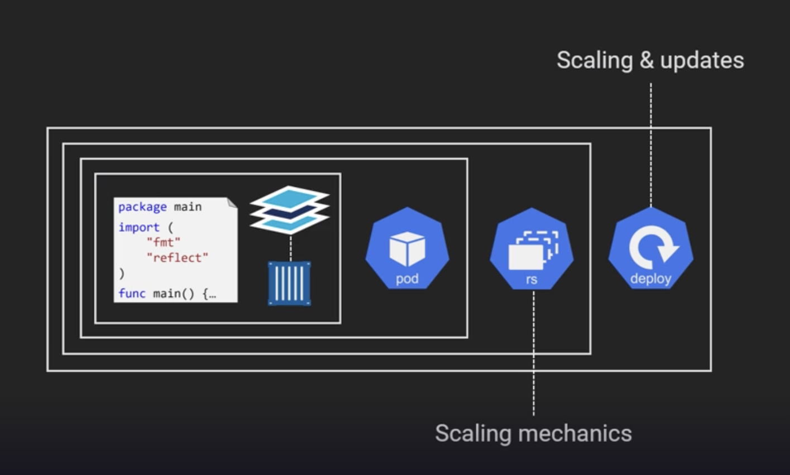
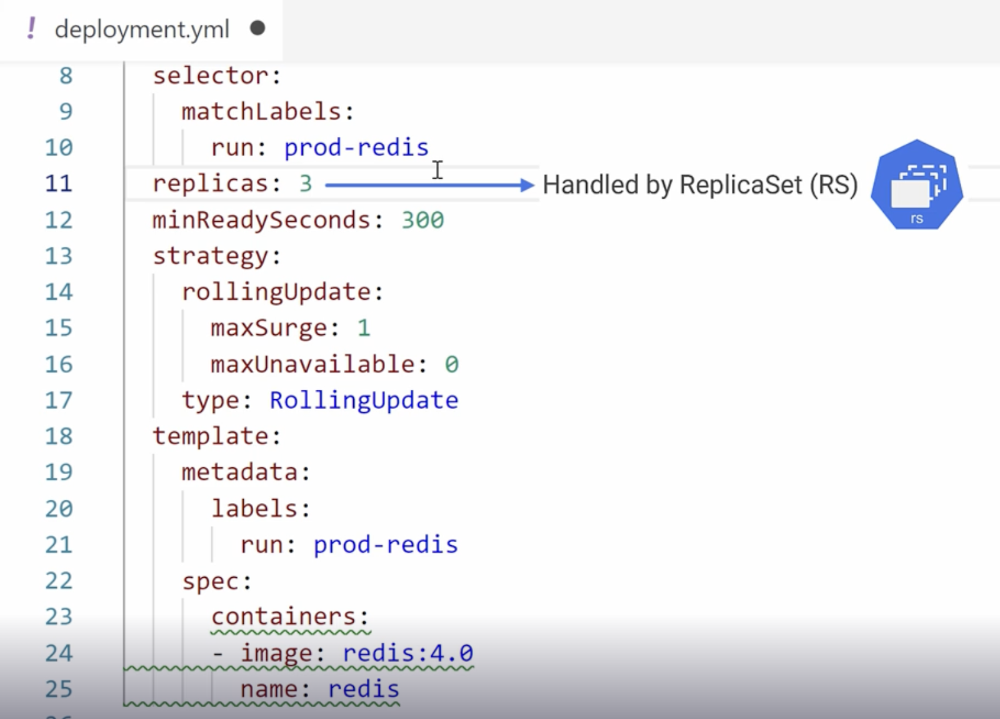
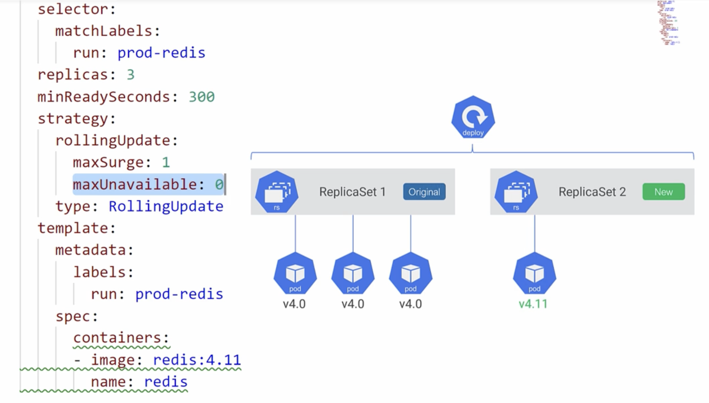

## Deployments

- Kubernetes don't run containers. They need to be wrapped in a pod.
- Pods have the advantage of deploying the app containers along with sidecar containers like service mesh, logging etc.
- Pods can't do anything on their own when it comes to scaling or releases.
- Deployments are high-level objects than pods. They are all about scaling and releases.
  - Deployments don't directly work on the scaling.
  - `ReplicaSets` are the ones which actually work on the scaling mechanics of the pods.
  - These are higher level objects than pods, but lower than deployments.
  - We don't work directly with ReplicaSets, we deal with deployments in the yaml configuration.
- Deployment works only with one type of pod. We can't deploy both frontend app and backend app with single deployment configuration.



- Sample deployment configuration with replicas.



- Always ensure to deploy through manifest file to keep the cluster and configuration in sync.

## Deployment Strategies

- Kubernetes supports many types of deployment strategies
  - Recreate
  - Rolling
  - Blue/Green
  - Canary
  - A/B testing
  - Shadow
- Recreate and RollingUpdates are the only two configuration that comes out of the box with K8S.
- Here is the sample configuration for rolling update.
```yaml
replicas: 3
minReadySeconds: 300
strategy:
  rollingUpdate:
    maxSurge: 1
    maxUnavailable: 0
```
- `maxSurge` denotes while performing update how many more pods can be surged than the desired state.
  - Percentage can also given as value to `maxSurge`. For ex: `50%`.
- `maxUnavailable` denotes how many pods go down below desire state.
- `minReadySeconds` defines time to wait between each pod deployment.
- A new replicaset is created during rollingUpdate and starts incrementing one by one as shown in the below picture.



- If we directly try to work with replicaset, they auto heal based on the desired state.
- It is always recommended working with deployments, not with replicaset.
- Any deployment that is currently in progress will be stopped if a new deployment request comes.

## Deploy

- To deploy use the command `kubectl apply -f deploy.yaml`.
  - To record the deployment `kubectl apply -f deploy.yaml --record`
- To view the deployment `kubectl get deploy test --watch` where test is the name as defined in the metadata of the deployment yaml.
  - watch flag is to monitor the deployment.
- To view the completed details `kubectl describe deploy watch`.
- To view the replicasets `kubectl get rs`
  - The name of the replicaset has the format of `${deploy_name}-${random_hash}`
- If we update the new version of the app and then re-apply the deployment, rollout status can be seen with the below command.
  - `kubectl rollout status deploy test`.
- Rollout has an option view history if deployments happen with the `--record` flag.
  - `kubectl rollout history deploy test`.
  - History gives details about all revisions.
  - To view the details of a specific revision from the above command output.
  - `kubectl rollout history deploy test --revision=3`
- To rollback to previous version
  - `kubectl rollout undo deploy test`
- Rollback with above command is imperative not declarative. 
  - This might cause issues because deploy.yaml file might still have the latest version of the image. 
  - This mismatch can lead to problems especially when we want to scale the app, this may inadvertently can deploy wrong version.
  
  
  
  
  