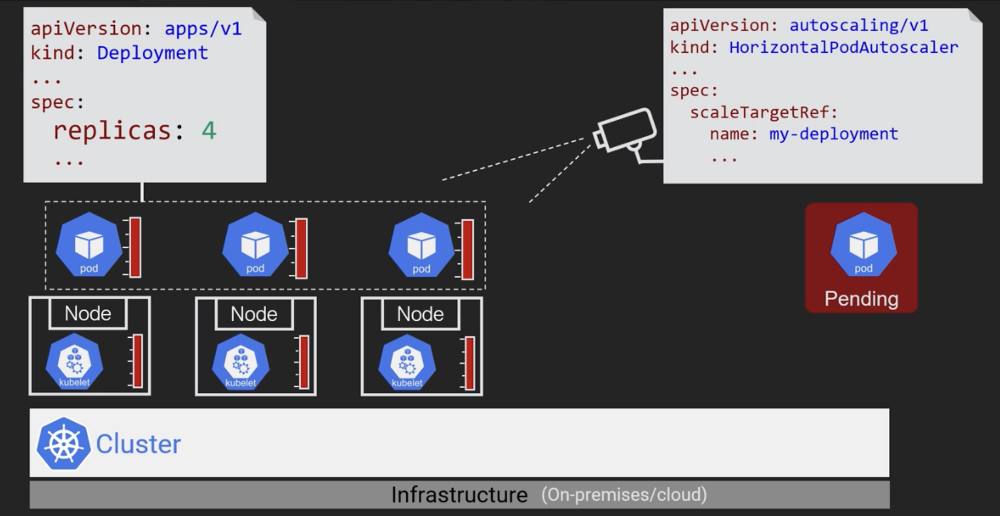
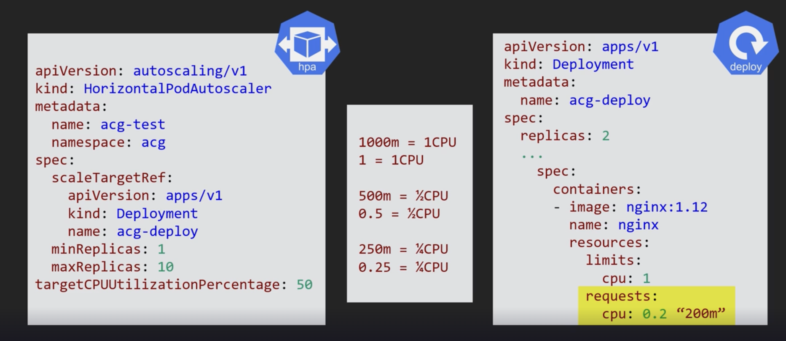

# Scaling

- Scaling increases the no of pods when demand goes up and reduces when demand goes down.
- Scaling is only based on cpu or memory metrics in k8s autoscaling/v1
- Since autoscaling/v2 other custom criteria like no of messages in the queue, no of open connections etc are added.

## Autoscaling

- The deployment yaml has replicas property using which we can scale up and down manually.
- To automatically add more pods k8s has HPA(horizontal pod autoscaler).
- To increase the no of nodes in the cluster node-pool k8s has cluster autoscaler depending on cloud provider.



- When there is not enough space for running a new pod, the pod goes to pending state as shown above until cluster autoscaler increases the nodes.

# HPA

- HPA is all about pods. It scales pods, watches pod metrics etc.
- When demand goes up it scales out pods, whereas when demand goes down it scales in pods.
- HPA does scale out/in pods automatically.
- We define one HPA configuration per deployment.
- To make HPA work, pods(in deployment yaml) have to be created with resource requests.
- Look at the below screenshot to understand about HPA.



- 1 virtual cpu on the cloud platform is equal to 1cpu in k8s. 
- 1 cpu is equal to 1000 milli cores. We can define cpu configuration either as cpu units or no of millicores.
- In the autoscaler configuration targetCPUUtilizationPercentage is 50 percent, which means if cpu usage reaches 100 millicores, a new pod is created.
- HPA configuration defines minReplicas and maxReplicas.
- HPA doesn't do scaling on its own, it updates no of replicas in Deployment which is monitored by watch loops in control plane.
- A more detailed walk through of HPA can be found at [HPA walkthrough](https://kubernetes.io/docs/tasks/run-application/horizontal-pod-autoscale-walkthrough/).

## Demo

- The below yaml configuration uses name-spaces to seperate deployments onto different groups.
- It uses the sample image from kubernetes website, which increase the load on cpu when hit and causes HPA to create more pods.

```yaml
apiVersion: v1
kind: Namespace
metadata:
  name: acg-ns
---
apiVersion: v1
kind: Service
metadata:
  namespace: acg-ns
  name: acg-lb
spec:
  type: LoadBalancer
  ports:
  - port: 80
  selector:
    app: acg-stress
---
apiVersion: apps/v1
kind: Deployment
metadata:
  namespace: acg-ns
  labels:
    app: acg-stress
  name: acg-web
spec:
  selector:
    matchLabels:
      app: acg-stress
  replicas: 1
  strategy:
    rollingUpdate:
      maxSurge: 1
      maxUnavailable: 0
    type: RollingUpdate
  template:
    metadata:
      labels:
        app: acg-stress
    spec:
      containers:
      - image: k8s.gcr.io/hpa-example
        name: stresser
        ports:
          - containerPort: 80
        resources:
          requests:
            cpu: 0.2
---
apiVersion: autoscaling/v1
kind: HorizontalPodAutoscaler
metadata:
  name: acg-hpa
  namespace: acg-ns
spec:
  scaleTargetRef:
    apiVersion: apps/v1
    kind: Deployment
    name: acg-web
  minReplicas: 1
  maxReplicas: 10
  targetCPUUtilizationPercentage: 50
```

- Deploy the above file using kubectl command `kubectl apply -f hpademo.yaml`.
- To view the hpa objects on k8s `kubectl get hpa --name-sapce acg-ns`.
- To generate the load run the command to open a shell `kubectl run -i --tty loader --image=busybox /bin/sh` and execute the below code.

```shell
while true; do wget -q -O- http://acg-lb.acg-ns.svc.cluster.local; done
```
- Because the load balancer is internet facing, we can run this from our local machines also.
- Once the above script is run, we can run a watch on hpa using `kubectl get hpa --name-space acg-ns --watch`.
- HPA doesn't scale pods on its own. It requests deployment to update the number of replicas.
- Deployment yaml configuration keep updated when scaling up/down.
  - Watch the current yaml configuration with the command `kubectl get deploy --name-sapce acg-ns -o yaml`.

## Cluster Auto scaler

- K8S clusters are created from node-pools of the underlying cloud provider.
- A node-pool is a set of vm's with similar configuration(RAM/CPU/Storage).
- Create multiple node-pools based on different needs. For ex, memory, graphical, process needs.
- Create a gke cluster with --enable-autoscaling for autoscaling of nodes with min and max node configuration.
- HPA scales in/out based on actual metrics of the pods. 
- Cluster autoscaling works only when resources are requested, which happens when pods go to pending state.
  - So, Cluster auto scaler works only when pods are configured with resource requests.
- Don't change node-pools configuration directly, use only cluster auto scaler because it continuously monitor 
  the changes to cluster and reset them as per the desired state.
- Check for cloud provider specific documentation before making changes.
  
## Demo

- This demo uses GKE as cloud provider.
- The command to create a node pool in GKE use `gcloud container node-pools create my_pool`.
- The command to create a cluster `gcloud container clusters create my_cluster --node-pool my_pool`.
- To enable autoscaling `gcloud container clusters update my_cluster --enable-autoscaling --min-nodes=1 --max-nodes=10`.
- Refer to GKE documentation for futher details.

## Virtual Pod Autoscaler

- Vertical Pod autoscaling provides recommendations for resource usage over time.
- Use the HPA for sudden increases in resource usage.
- Vertical Pod autoscaling lets you analyze and set CPU and memory resources required by Pods.
- We can configure vertical Pod autoscaling to provide recommended values for CPU and memory requests and 
  limits that you can use to manually update your Pods.
- Due to Kubernetes limitations, the only way to modify the resource requests of a running Pod is to recreate the Pod.
- To limit the amount of Pod restarts, use a Pod disruption budget.
  - We can specify only one of maxUnavailable and minAvailable in a single PodDisruptionBudget. 
  - maxUnavailable can only be used to control the eviction of pods that have an associated controller managing them. 
  - In the examples below, "desired replicas" is the scale of the controller managing the pods being selected by the PodDisruptionBudget.
- For more information refer [Pod Disruption Budget](https://kubernetes.io/docs/tasks/run-application/configure-pdb/)

```yaml
apiVersion: policy/v1
kind: PodDisruptionBudget
metadata:
  name: zk-pdb
spec:
  minAvailable: 2
  selector:
    matchLabels:
      app: zookeeper
```
- For more information on VPA refere [VPA](https://github.com/kubernetes/autoscaler/tree/master/vertical-pod-autoscaler)
