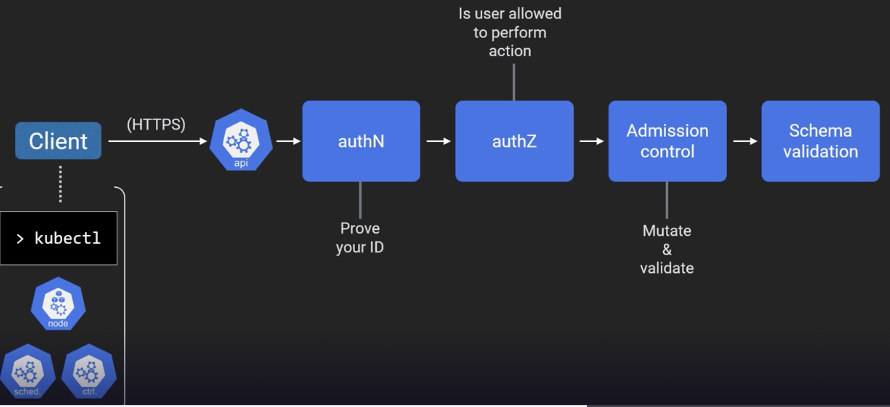
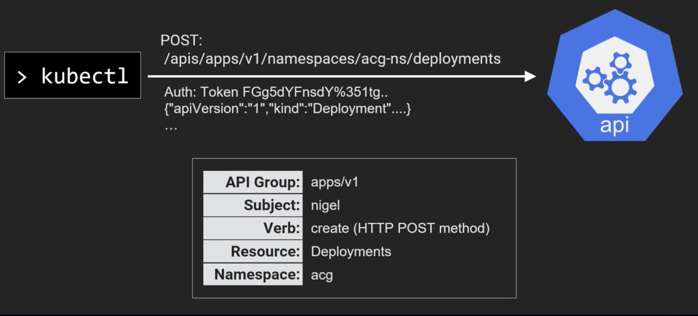
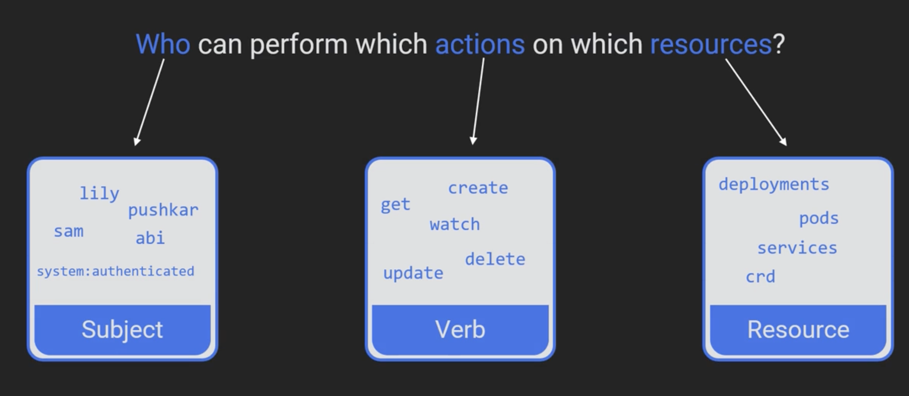
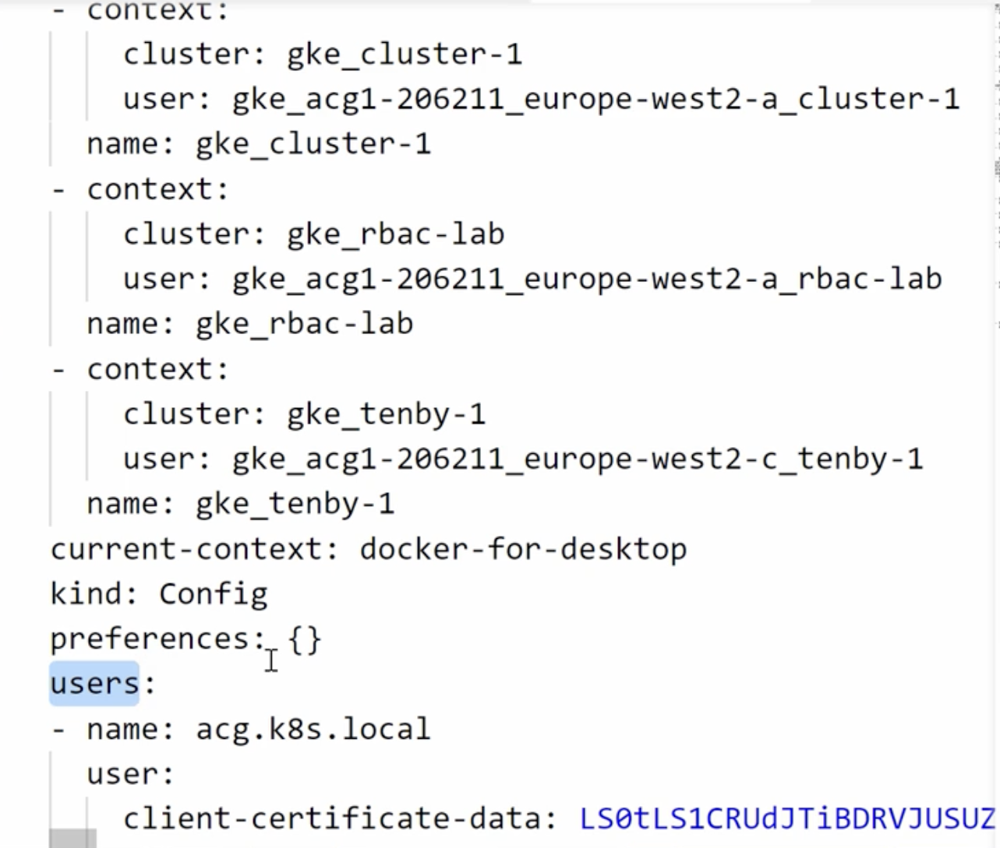
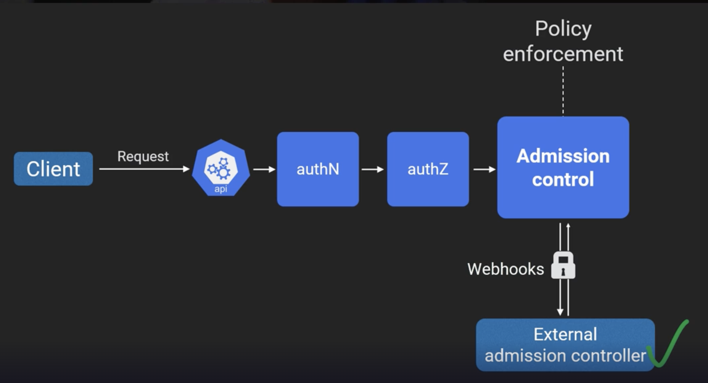

## Big picture

- Everything in the k8s happens through api server.
- All operations from client(typically kubectl) happen through rest CRUD calls.
- The internal cluster communication makes a lot of requests to api servers. For ex:
  - Each node runs a kubelet which talks to api server.
  - Every member of the control plan like scheduler and controller also talk to api server.
- All communication from client to api server is secured.
  - If you are using a cloud provider like gcp, connection string from gcp console downloads certificates to your local machine.
- Once TLS is established, the authentication(authN) phase starts.
  - After authN, authorization(authZ) phase starts.
  - After authN and authZ, admission control phase starts.
  - With admission control we can mutate(modification) & validate requests.
    - We can implement some modification policies at admission control. For ex, download images from a specific repository.
    - After mutation admission controllers, validation controllers start validating.
    - After mutate and validation controllers, schema validation or object specific validation occurs.
- If all the validations are successful, then the object is persisted to `etcd`.
  


## RBAC

- Role based access controls are enabled in k8s since 1.6 and GA since 1.8.
- By design, it is deny-by-default system, means when enabled everything is locked.
  - It means, we need add specific add allow rules to start allowing operations.
  - This indicates that there are no deny rules in RBAC, there are only allow rules.
  
## AuthN

- By default, k8s comes with few options for authentication like `Bearer tokens`,`Client certificates`,`Bootstrap tokens`.
- Also, k8s supports external systems like openId connect(to integrate with Active directory and IAM providers) etc.
- K8S does not manage users. All regular users must be created and managed outside the cluster.

### Service Accounts

- There are other types of users in k8s called `Service Accounts` which are stored in k8s.
- These are used only by the components of k8s system components like kubelets and other parts of the control plane.
- Service accounts also need to be authenticated with the api server.
- Service accounts are managed by the k8s cluster, and their credentials are stored in k8s secrets.
- We should manage service accounts. 
- More granular these service accounts is better but difficult to manage. So we should give a thought on these.
  - For ex, Does every object in the namespace should have their own service account or one per deployment?
- `Note:` Every pod and every component on the control plane gets associated with a service account while interacting with api service, so choose wisely.



## AuthZ

- Authenticated users should have permissions to perform actions on resources.
- AuthZ is the place where RBAC applies.
- RBAC is about `who` can perform `which` action on `what` resources?



### Context

- A k8s context is a group of access parameters that define the following.
  - which cluster you're interacting.
  - which user you're using.
  - which namespace you're working in.
- It's helpful if you need to access different clusters for different purposes.
- It also helps to limit your access to certain parts of a cluster.
- For example, if you have multiple Kubernetes clusters, each with its own set of users and permissions, 
  you can use `kubectl config use-context` to switch between them.
  

  
  
## Role and Role Bindings

- When a cluster is created, we get a context and an user with all permissions. But, this is the least we want for production.
- As we know, by default RBAC policy is deny-by-default, though we have users with permission.
- So, we need to create users and grant them permissions. We need the following things to do that. 
  
### Roles
- Role is a resource on the api under `rbac.authorization.k8s.io/v1`
- Roles are about rules.
- Roles define `which` actions on `which` users in RBAC.  
- The following configuration shows permissions to get, list and watch pods.
- apiGroups are SIGs. For ex, if roles are for deployments then `apiGroups: ["apps"]`
  
```yaml
Kind: Role
apiVersion: rbac.authorization.k8s.io/v1
metadata:
  name: acgrbc
  namespace: acg
rules:
  - apiGroups: [""]
    resources: ["pods"]
    verbs: ["get", "list", "watch"]
  - apiGroups: ["rbac.authorization.k8s.io"]
    resources: ["pods", "deployments"]
    verbs: ["get", "list", "watch"]

```    

### RoleBindings

- RoleBindings define `who` in RBAC.
- Here is the sample yaml file.
- RoleBindings can be done at a user level or at a group level.

```yaml
Kind: RoleBinding
apiVersion: rbac.authorization.k8s.io/v1
metadata:
  name: acgrbac
  namespace: acg
subjects:
- kind: User
  name: tulasiram@acg.com
  apiGroup: ""
- kind: Group
  name: ops
  apiGroup: rbac.authorization.k8s.io
- kind: Group
  name: system:masters
  apiGroup: rbac.authorization.k8s.io
roleRef:
  kind: Role
  name: acgrbac
  apiGroup: ""
```

### ClusterRole and ClusterRoleBinding

- They are similar to Role and RoleBindings, but not scoped to a namespace.
- They are not advisable to use, because their permissions are scoped to the entire cluster.
- If you really want to use cluster wide permissions, create ClusterRole and Bind them using RoleBinding instead of ClusterRoleBinding.
- The command to view roles `kubectl get roles role_name`.
- The command to view rolebindings `kubectl get rolebindings user_name`.
- To watch the yaml `kubectl get clusterrolebindings docker-for-desktop -o yaml`.

## Admission control

- Admission control is still in beta as of k8s 1.11.
- Admission control policies come into work after authN and authZ to enforce policies.
- Admission control let us plugin external controllers into k8s to enforce policies.
  - Security to access external controllers must be very important because they may create bugs in the system which might compromise access to api server.




  