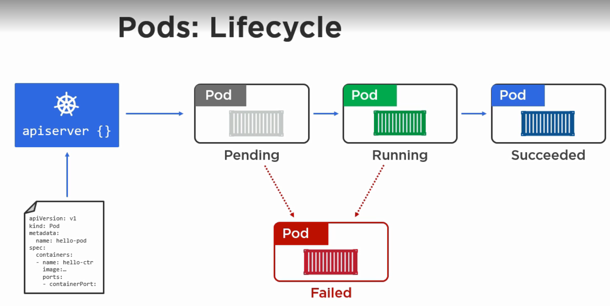

# kubernetes

## Pods

- In Virtualization world the atomic unit of scheduling is `VM`, in docker it is the `container`, whereas in kubernetes it is `pod`.
- Pod is a high level construct than a container, but it is much simpler(or smaller) than a VM.
- A pod consists of one or more containers. If multiple services need to be coupled, then having multiple containers in a pod is better.
- We deploy a pod to a cluster by defining it in a manifest file. Manifest file is passed to the api-server using cli to the scheduler. Scheduler deploy the pods to a node.
- Depending on the manifest file, a pod may contain one or more containers.
- A pod gets a single ip, irrespective of how many containers are present in the pod. So, ports have to be unique between the containers.
- All the containers in a pod share the same cgroup limit, access to same volumes, same network, ipc namespaces etc.
- Inter-pod communication is possible because all pod ipaddresses are routable on the pod network.
- Intra-pod communication happens directly through `localhost` interface.
- Deployment in a pod is atomic. If 2 containers are present in a pod, then a pod will be accessible only when both containers are up and running.
- Lifecycle of Pod
  - Define the manifest.
  - Send the manifest to api server.
  - Api server schedules it to a node.
  - Pod goes to `Pending` state while the node download the images and start the containers.
  - Pod stays in `Pending` state until all containers are up and running.
  - Once all containers are up, pod state changes to `Running`. Incase of failure, pod goes to `Failed` state.
  - Failed, stopped Pods can't be restarted. They are discarded and new ones are started inplace of failed nodes.
  
  
  
## Deploying pods with Manifest

- Please see the sample manifest file.

		--- 
		apiVersion: v1
		Kind: Pod
		metadata: 
		  name: hello-pod
		    labels:
			  zone: prod
			  version: v1
		spec: 
		  containers: 
		  - name: hello-ctr
		    image: "nigelpoulton/pluralsight-docker-ci:latest"
		    ports: 
		    - name: hello-ctr
		      containerPort: 8080
  
- `apiVersion` refers to version of kubernetes apiserver rest objects.
- `Kind` defines what kind of an object to deploy on the cluster. `Kind` helps to use the same command to work with kubernetes for different kinds of objects.
- `metadata` used to define metadata for the pod like name of the pod, environment, version etc.
- `spec` section defines the pod.
   - `containers` section to define one or more containers.
	 - `name` section defines the name of the container
	 - `image` defines the image that is used to run the container.
	 - `containerPort` is the port to be exposed on the container.
- save the manifest file, say `pod.yml`.	 
- To run the pod on kubernetes cluster, use the command `kubectl create -f pod.yml`
- To view all the pods running use the command `kubectl get pods`.
- To view the pod information in detail `kubectl describe pods`.
- To view the pod information of a specific pod `kubectl get pods/${pod-name}`. For ex: `kubectl get pods/hello-pod`.
- To view all the pods in all namespaces including system pods, use `kubectl get pods --all-namespaces`.
- To delete a pod `kubectl delete pods ${pod-name}`.

## Tools

- kubectl is command line tool to interact with api server.
- minikube, kubeadm tools help to run local kubernetes cluster.
- If managed clusters like GKE, AKS or EKS no need of minikube, kubeadm. kubectl is enough.

[Next: big picture](1.big_picture.md)
